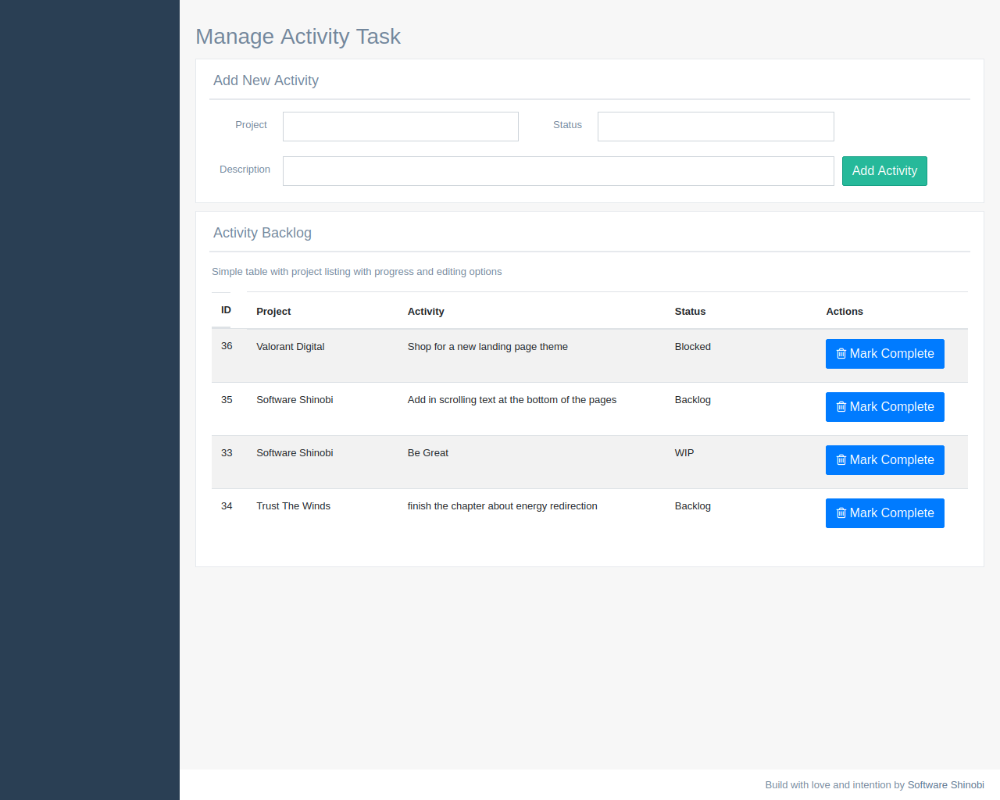

# An Activity Manager For All Those Tasks You Should Probably Take Care Of

In this repository will find a spring mvc web application that managers a collection of activities in a backlog.

Basically, this is a glorified todo list. I just tried to call it something fancy.



## Prologue

I did this for Her.

I did this for the Universe.

## About This Project

This is a todo list.

You can add and delete stuff from a todo list.

This is super next-level tech.

We can't let the [redacted] get their hands on this.

## Quick Start: Activity Manager Dashboard

Getting started with this project is pretty simple.

You can load it up in your favorite IDE. Or, you can run the quick start bash script at the repository root. 

Like this:

```bash
bash quick-start-activity-manager-dashboard.bash
```

Have fun!

## Ciao

From My Universe To Yours With Lots Of Love,

Software Shinobi

## Namaste.